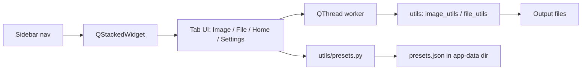

<div align="center">

# Utility Tool

**Batch image compression, resizing and file renaming from one desktop app.**

[](LICENSE)
[](https://github.com/TechCabana/utility-tool)
[](#)
[](https://github.com/TechCabana/utility-tool/commits/main)

[Overview](#overview) ·
[Installation](#installation) ·
[Architecture](#architecture) ·
[Testing](#testing) ·
[Contributing & Licence](#contributing--licence)

</div>

---

> **TL;DR**: Utility Tool is a PySide6 desktop app that batch-compresses, resizes and
> converts images, and batch-renames files, with reusable presets for both.

## Overview

| | |
| --- | --- |
| **Status** | Maintenance (feature-complete, fixes only) |
| **Stack** | Python 3.9+, PySide6 (Qt), Pillow |
| **Hosting** | None; runs locally as a desktop app |
| **License** | MIT |
| **Live** | Not applicable, no hosted deployment |

### Goal

Give a single desktop tool for the two file chores that come up over and over: shrinking
and reformatting a folder of images, and renaming a batch of files by a pattern. Both tools
share one preset system, so a saved image or rename configuration can be reused without
re-entering it. "Finished" means both tools run reliably offline against local files, with
progress feedback for long batches.

### Scope

| In scope | Not in scope |
| --- | --- |
| Compressing, resizing and format-converting images (JPEG, PNG, WEBP) | Editing images beyond resize/format/compress (no crop, filters, colour edits) |
| Fixed passport/photo/print size presets (India and Netherlands passport, 4x6, A4, A5, Instagram) | Arbitrary custom paper sizes beyond the built-in list |
| Batch file renaming by pattern, regex, case and date tokens | Renaming based on file content or metadata beyond modified time |
| Saving and loading presets for both tools (`utils/presets.py`) | Syncing presets across machines or accounts, no cloud storage |
| Windows and macOS, run from source or packaged with PyInstaller | An installer/updater; PyInstaller output is a raw binary only |

The Home tab's preset save/apply/delete buttons are wired to placeholder handlers
(`tabs/home_tab.py`) rather than the real functions in `utils/presets.py`. The storage
layer works; the Home tab UI just does not call it yet.

---

## Installation

### Prerequisites

| Requirement | Version | Notes |
| --- | --- | --- |
| Python | 3.9+ | Only interpreter this was built against |
| pip | Any recent | Installs the two pinned dependencies |

### 1. Clone

```bash
git clone https://github.com/TechCabana/utility-tool.git
cd utility-tool
```

### 2. Install

```bash
python -m venv venv
# macOS/Linux
source venv/bin/activate
# Windows (PowerShell)
.\venv\Scripts\activate

pip install -r requirements.txt
```

Installs `PySide6==6.7.2` and `Pillow==10.2.0`.

### 3. Run

```bash
python main.py
```

A dark-themed window opens with a sidebar and four tabs: Home, Image Tools, File Tools,
Settings.

### 4. Verify

There is no automated test suite (see [Testing](#testing) note below). Confirm the install
worked by checking that the window opens, the dark stylesheet is applied (not the plain
OS default), and all four sidebar tabs switch pages when clicked.

### 5. Configure

No environment variables or secrets are needed. Presets are written automatically to an
OS-specific per-user directory the first time the app runs (`utils/presets.py`, function
`app_dir()`):

| Platform | Location |
| --- | --- |
| Windows | `%APPDATA%\UtilityTool\presets.json` |
| macOS | `~/Library/Application Support/UtilityTool/presets.json` |
| Linux | `~/.config/UtilityTool/presets.json` |

Nothing here is committed to the repo, and nothing needs to be.

### Everyday use

| Task | Command |
| --- | --- |
| Run from source | `python main.py` |
| Build a standalone binary | `pip install pyinstaller` then `pyinstaller --onefile --windowed main.py --name "UtilityTool"` |

The build step writes `dist/UtilityTool.app` on macOS or `dist/UtilityTool.exe` on Windows.

### If it does not work

| Symptom | Cause | Fix |
| --- | --- | --- |
| Window opens with no dark styling | `styles/dark.qss` failed to load | Run from the repo root; the path in `main.py` is relative. Check the console for a `[WARN] Could not load stylesheet` line |
| No app icon in the title bar | `main.py` points at `assets/icon.png`, which is not committed to the repo | Harmless: Qt silently skips a missing icon path. See the TODO below |
| Rename or convert stops partway through a batch | A destination folder is missing or not writable | Point the destination picker at a folder you have write access to |

**TODO(owner):** `main.py` references `assets/icon.png` for the window icon, but no
`assets/` directory exists in the repo. Either commit the icon or drop the
`setWindowIcon` call.

---

## Architecture

### Tools and technologies


| Layer | Choice | Why this one |
| --- | --- | --- |
| Language | Python 3.9+ | Same language on both target OSes, minimal setup for a personal tool |
| UI toolkit | PySide6 (Qt for Python) | Native-feeling cross-platform desktop widgets, QSS for theming |
| Image processing | Pillow | Handles resize/convert/compress and EXIF without a native dependency |
| Storage | JSON file in the OS app-data directory | No database needed for a handful of saved presets |
| Hosting | None (local desktop app) | Nothing to deploy or serve |
| Automation | None | No CI configured; see [Testing](#testing) |
| Testing | None | No automated suite exists yet |

### How the pieces fit



<!-- ASCII fallback:
```
  Sidebar nav -> QStackedWidget -> Tab UI -> QThread worker -> utils -> output files
                                        \-> utils/presets.py -> presets.json
```
-->

### End to end walk-through

1. `main.py` builds `MainWindow`, loads `styles/dark.qss`, and mounts four tabs (Home,
   Image Tools, File Tools, Settings) into a `QStackedWidget` switched by the sidebar
   buttons.
2. In `tabs/image_tab.py` or `tabs/file_tab.py`, the user picks files and sets options: an
   output format, a fixed size preset, and quality for images; a rename pattern, regex and
   case rule for files.
3. Starting a batch spawns a `QThread` running `ImageWorker` or `FileWorker`, which calls
   the pure functions in `utils/image_utils.py` or `utils/file_utils.py` per file and emits
   progress signals the tab renders as per-file progress bars.
4. Presets saved from a tool tab go through `utils/presets.py`, which reads and writes
   `presets.json` in the OS-specific app-data directory shown in
   [Configure](#5-configure), and reloads on the next launch.

<details>
<summary><b>Why this approach, and what was rejected</b></summary>

| Decision | Alternative considered | Why the choice was made |
| --- | --- | --- |
| Desktop GUI (PySide6/Qt) | A local web app (Flask + JS) | Reads and writes local files directly with no browser file-access restrictions |
| Per-batch `QThread` workers | Running image/rename work on the UI thread | Keeps the window responsive during a large batch and gives real progress bars instead of a frozen UI |
| Presets as a JSON file in the OS app-data directory | A bundled SQLite database, or presets inside the repo | No database dependency for a handful of records, and survives an app reinstall since it lives outside the repo |

</details>

<details>
<summary><b>Data model</b></summary>

One JSON file (`presets.json`), two lists: `image` and `file`. Shown here in the shape
`utils/presets.py` writes by default.

```json
{
  "image": [
    {
      "name": "Default Image (JPEG 85)",
      "format": "JPEG",
      "quality": 85,
      "size_key": "Original",
      "prefix": "",
      "suffix": "",
      "keep_exif": true
    }
  ],
  "file": [
    {
      "name": "Default File (date prefix)",
      "pattern": "{date:%Y%m%d}_{name}",
      "prefix": "",
      "suffix": "",
      "start": 1,
      "pad": 3,
      "regex_find": "",
      "regex_replace": "",
      "case": "none",
      "date_source": "now"
    }
  ]
}
```

| Field | Type | Notes |
| --- | --- | --- |
| `format` | string | `JPEG`, `PNG`, `WEBP` or `ORIGINAL` to keep the source format |
| `size_key` | string | Key into the fixed size list in `utils/image_utils.py`, or `Original` |
| `quality` | int | JPEG/WEBP quality, 1-100 |
| `pattern` | string | Rename template; supports `{name}`, `{ext}`, `{num}`, `{date:FMT}` tokens |
| `case` | string | `none`, `lower`, `upper` or `title`, applied to the final name |

</details>

<details>
<summary><b>Project structure</b></summary>

```
utility-tool/
├── main.py               app entry point; window shell, sidebar, tab wiring
├── requirements.txt      pinned runtime dependencies (PySide6, Pillow)
├── LICENSE                MIT
├── styles/
│   └── dark.qss           Qt stylesheet for the dark theme
├── tabs/                  one QWidget per sidebar page
│   ├── home_tab.py         preset manager UI (save/apply/delete are placeholders)
│   ├── image_tab.py        image compress/resize/convert UI + worker thread
│   ├── file_tab.py         batch rename UI + worker thread
│   └── settings_tab.py     settings placeholder, no options yet
└── utils/                 pure logic, no Qt imports
    ├── image_utils.py      Pillow-based resize/convert/compress helpers
    ├── file_utils.py       filename pattern, regex and case helpers
    └── presets.py          JSON preset load/save, OS app-data path
```

| Path | Role |
| --- | --- |
| `main.py` | Composes the window, sidebar and tabs; loads the QSS theme |
| `tabs/` | UI for each sidebar page, one file per tab |
| `utils/` | Framework-free helpers the tabs call into; safe to unit test in isolation |
| `styles/dark.qss` | The only styling; no per-widget inline styles beyond a few labels |

</details>

---

## Testing

There is no automated test suite in this repo: no `tests/` directory and no test
dependency in `requirements.txt`. Verification today is manual, per the
[Verify](#4-verify) and [If it does not work](#if-it-does-not-work) steps above.

**TODO(owner):** decide whether `utils/image_utils.py` and `utils/file_utils.py` (the
Qt-free logic layer) are worth a small `pytest` suite. They take plain paths and strings
in, so they would not need a Qt test harness.

---

## Contributing & Licence

### Contributing

Issues and pull requests are welcome. Open an issue before starting anything large, so the
approach can be agreed first. Commits follow
[Conventional Commits](https://www.conventionalcommits.org/en/v1.0.0/), and work lands on
`main` through a pull request.

### Licence

Released under the MIT licence. The full text is in [LICENSE](LICENSE), and it covers the
code in this repository only.

**TODO(owner):** the `LICENSE` file currently holds only the title "MIT License" with no
copyright line or permission text. Shields.io and GitHub's own license detector may not
recognise it as MIT until the standard MIT template text is filled in.

### Credits and third-party terms

- Image processing via [Pillow](https://python-pillow.org/), MIT licensed.
- UI built on [PySide6](https://doc.qt.io/qtforpython-6/), LGPLv3 licensed (Qt for Python).

---

<div align="center">

<sub>Built and maintained by <a href="https://github.com/TechCabana">TechCabana</a></sub>

</div>
