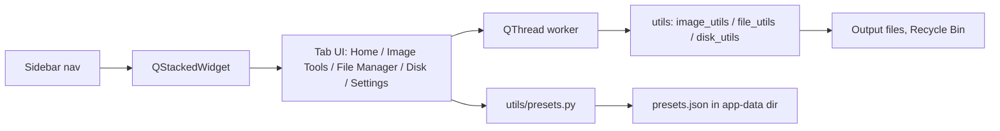

<div align="center">

# Utility Tool

**Batch image tools, file operations and disk cleanup in one offline desktop app.**

[](LICENSE)
[](https://github.com/TechCabana/utility-tool)
[](#)
[](https://github.com/TechCabana/utility-tool/commits/main)

[Overview](#overview) ·
[Installation](#installation) ·
[Architecture](#architecture) ·
[Testing](#testing) ·
[Contributing & Licence](#contributing--licence)

</div>

---

> **TL;DR:** Utility Tool is a PySide6 desktop app with three pillars: batch image
> compress/resize/convert, batch file rename/move/copy/delete, and disk cleanup with
> duplicate detection. All three share one pattern-based preset system, and the app runs
> fully offline.

## Overview

| | |
| --- | --- |
| **Status** | Maintenance (feature-complete, fixes only) |
| **Stack** | Python 3.9+, PySide6 (Qt), Pillow |
| **Hosting** | None; runs locally as a desktop app |
| **License** | MIT |
| **Live** | Not applicable, no hosted deployment |

### Goal

One desktop tool for the file chores that come up over and over: shrinking and reformatting a
folder of images, renaming or relocating a batch of files, and clearing out the junk and
duplicates eating disk space. All three share one pattern-naming preset system, so a saved
image or file configuration can be reused without re-entering it. "Finished" means every tool
runs reliably offline against local files, with real progress feedback on long batches.

### Scope

| In scope | Not in scope |
| --- | --- |
| Compressing, resizing and format-converting images (JPEG, PNG, WEBP) | Editing images beyond resize/format/compress (no crop, filters, colour edits) |
| Fixed passport/photo/print size presets (India and Netherlands passport, 4×6, 5×7, A4, A5, Instagram square) | Arbitrary custom paper sizes beyond the built-in list |
| Batch file rename by pattern, regex, case and date tokens | Renaming based on file content or metadata beyond modified time |
| Batch move, copy and delete (File Manager) via one operation picker, with a conflict policy and Recycle-Bin-only delete | Undo for a completed batch operation |
| Disk usage overview (drive used/free, per-folder breakdown) | |
| Disk Cleanup: an 8-category reclaimable-space quick scan, moving checked items to the Recycle Bin | |
| Disk Duplicates (a section inside Cleanup): exact-hash matching for files, perceptual dHash matching for images | Backup (Disk's fourth pillar), not built yet: blocked on an owner decision about scheduler design, tracked as its own card |
| Pattern-based naming shared by Image Tools and File Manager, with 11 starter presets (6 image, 5 file) managed from Settings | Syncing presets across machines or accounts, no cloud storage |
| Windows and macOS, run from source or packaged with PyInstaller | An installer/updater; PyInstaller output is a raw binary only |

---

## Installation

### Prerequisites

| Requirement | Version | Notes |
| --- | --- | --- |
| Python | 3.9+ | Only interpreter this was built against |
| pip | Any recent | Installs the four pinned dependencies |

### 1. Clone

```bash
git clone https://github.com/TechCabana/utility-tool.git
cd utility-tool
```

### 2. Install

```bash
python -m venv venv
# macOS/Linux
source venv/bin/activate
# Windows (PowerShell)
.\venv\Scripts\activate

pip install -r requirements.txt
```

Installs `PySide6==6.7.2`, `Pillow==10.2.0` and `send2trash==2.1.0`. File Manager's Delete
and Disk Cleanup's "Clean Selected" both route through `send2trash`, so a batch delete always
goes to the Recycle Bin, never a permanent delete. Also installs `pytest==9.1.1`, listed in
the same flat `requirements.txt` since no dev/prod split convention exists in this repo yet.

### 3. Run

```bash
python main.py
```

A light-themed window opens with a sidebar and five tabs: Home, Image Tools, File Manager,
Disk, Settings. The window title bar still reads "Utility Tool - Swiss Army Edition"
(`main.py`'s `setWindowTitle`), a leftover from before the v1 redesign. The icon and every
other surface in the app now go by "Utility Tool" alone.

### 4. Verify

Run the automated suite (`pytest tests/`, see [Testing](#testing)), then confirm the install
worked by checking that the window opens, the light Soft Rose stylesheet is applied (not the
plain OS default), and all five sidebar tabs switch pages when clicked.

### 5. Configure

No environment variables or secrets are needed. Presets are written automatically to an
OS-specific per-user directory the first time the app runs (`utils/presets.py`, function
`app_dir()`):

| Platform | Location |
| --- | --- |
| Windows | `%APPDATA%\UtilityTool\presets.json` |
| macOS | `~/Library/Application Support/UtilityTool/presets.json` |
| Linux | `~/.config/UtilityTool/presets.json` |

Nothing here is committed to the repo, and nothing needs to be.

### Everyday use

| Task | Command |
| --- | --- |
| Run from source | `python main.py` |
| Build a standalone binary | `pip install pyinstaller` then `pyinstaller --onefile --windowed main.py --name "UtilityTool"` |

The build step writes `dist/UtilityTool.app` on macOS or `dist/UtilityTool.exe` on Windows.

### If it does not work

| Symptom | Cause | Fix |
| --- | --- | --- |
| Window opens with no theme styling | `styles/theme.qss` failed to load | Paths are resolved next to `main.py`, so the working directory does not matter; check the console for a `[WARN] Could not load stylesheet` line and that `styles/` was not moved |
| Text renders in a system font, not Geist | The bundled `.ttf` files under `assets/fonts/` are missing | Check the console for `[WARN] Could not load font`; restore `assets/fonts/` from the repo |
| A packaged binary is missing its font, icon or theme | `pyinstaller --onefile` alone does not bundle `assets/`, `styles/` or `widgets/` (confirmed against a real build, which reported "Copying 0 resources to EXE") | Add `--add-data` flags (or a `.spec` file) for `assets`, `styles` and `widgets` before packaging for distribution; running from source is unaffected |
| Rename, move, copy or a Cleanup/Duplicates removal stops partway through a batch | A destination folder is missing or not writable | Point the destination picker at a folder you have write access to |
| Windows taskbar shows the Python interpreter icon, not the app icon | `setWindowIcon()` sets the title-bar icon only; Windows groups taskbar icons by process, which needs an explicit AppUserModelID or a packaged binary | Cosmetic only: package with PyInstaller, or set an AppUserModelID before opening the window, to fix the taskbar icon specifically |

---

## Architecture

### Tools and technologies


| Layer | Choice | Why this one |
| --- | --- | --- |
| Language | Python 3.9+ | Same language on both target OSes, minimal setup for a personal tool |
| UI toolkit | PySide6 (Qt for Python) | Native-feeling cross-platform desktop widgets, QSS for theming |
| Image processing | Pillow | Handles resize/convert/compress and EXIF without a native dependency |
| File deletion | send2trash | Sends File Manager deletes and Disk Cleanup/Duplicates removals to the OS Recycle Bin/Trash, never a permanent delete |
| Storage | JSON file in the OS app-data directory | No database needed for a handful of saved presets |
| Packaging | PyInstaller `--onefile` | Measured against Nuitka onefile on this app: 47 MB / 2.9s cold start vs. 80 MB / 3.1s and a more fragile toolchain (see the decision table below) |
| Hosting | None (local desktop app) | Nothing to deploy or serve |
| Automation | None | No CI configured; see [Testing](#testing) |
| Testing | pytest, `utils/` only | See [Testing](#testing); the Qt-driven `tabs/` layer stays manually verified |

### How the pieces fit



<!-- ASCII fallback:
```
  Sidebar nav -> QStackedWidget -> Tab UI -> QThread worker -> utils -> output files / Recycle Bin
                                         \-> utils/presets.py -> presets.json
```
-->

### End to end walk-through

1. `main.py` builds `MainWindow`, registers the bundled Geist fonts, loads `styles/theme.qss`,
   and mounts five tabs (Home, Image Tools, File Manager, Disk, Settings) into a
   `QStackedWidget` switched by the sidebar buttons.
2. In `tabs/image_tab.py`, the user picks files and sets a format, a fixed size preset, and
   quality/compression. In `tabs/file_tab.py`, an operation picker (Rename/Move/Copy/Delete)
   swaps in only the fields that operation needs: a rename pattern/regex/case/date rule, or a
   destination folder and conflict policy for Move/Copy. Both tools share the same pattern-naming
   engine and preset shape.
3. In `tabs/disk_tab.py`, Overview reports drive used/free space and a per-folder breakdown;
   Cleanup runs an 8-category reclaimable-space quick scan and, in a section beneath it,
   Duplicates (Files: exact hash; Images: perceptual dHash), letting the user check items and
   send them to the Recycle Bin. Backup is a placeholder tab, not yet built.
4. Starting a batch spawns a `QThread` running the relevant worker (`ImageWorker`,
   `FileWorker`, or Disk's scan/clean workers), which calls the pure functions in
   `utils/image_utils.py`, `utils/file_utils.py` or `utils/disk_utils.py` per item and emits
   progress signals the tab renders as progress bars or live counts.
5. Presets saved from a tool tab go through `utils/presets.py`, which reads and writes
   `presets.json` in the OS-specific app-data directory shown in
   [Configure](#5-configure), and reloads on the next launch.

<details>
<summary><b>Why this approach, and what was rejected</b></summary>

| Decision | Alternative considered | Why the choice was made |
| --- | --- | --- |
| Desktop GUI (PySide6/Qt) | A local web app (Flask + JS) | Reads and writes local files directly with no browser file-access restrictions |
| PyInstaller `--onefile` | Nuitka onefile | Measured 2026-09-08 on a real build: PyInstaller came in at 47 MB / 2.9s cold start against Nuitka's 80 MB / 3.1s, plus a more fragile toolchain (an auto-downloaded MinGW compiler, one outright build failure). Worse on every axis measured |
| Per-batch `QThread` workers | Running image/rename/disk work on the UI thread | Keeps the window responsive during a large batch and gives real progress bars instead of a frozen UI |
| Presets as a JSON file in the OS app-data directory | A bundled SQLite database, or presets inside the repo | No database dependency for a handful of records, and survives an app reinstall since it lives outside the repo |
| Duplicates as a section inside Cleanup, not a fourth Disk sub-tab | A separate "Duplicates" sub-tab alongside Overview/Cleanup/Backup | Quick-scan junk and duplicate files are both "cleanup" from the user's point of view, so they live on one screen |

</details>

<details>
<summary><b>Data model</b></summary>

One JSON file (`presets.json`), two lists: `image` and `file`. 11 starter presets (6 image,
5 file) ship on first run only (see `utils/presets.py`'s `DEFAULT`); deleting one never brings
it back on the next launch. Image presets carry the same pattern-naming fields as file
presets, so both apply through one shared engine (`utils/file_utils.build_new_name`). Shown
here in the shape `utils/presets.py` writes by default:

```json
{
  "image": [
    {
      "name": "Web Upload",
      "format": "JPEG",
      "quality": 85,
      "size_key": "1920px long edge",
      "compression": 4,
      "keep_exif": true,
      "pattern": "{name}",
      "prefix": "",
      "suffix": "",
      "start": 1,
      "pad": 3,
      "regex_find": "",
      "regex_replace": "",
      "case": "none",
      "date_source": "now"
    }
  ],
  "file": [
    {
      "name": "Date Prefix",
      "pattern": "{date:%Y%m%d}_{name}",
      "prefix": "",
      "suffix": "",
      "start": 1,
      "pad": 3,
      "regex_find": "",
      "regex_replace": "",
      "case": "none",
      "date_source": "now"
    }
  ]
}
```

| Field | Type | Notes |
| --- | --- | --- |
| `format` | string | `JPEG`, `PNG`, `WEBP` or `ORIGINAL` to keep the source format (image presets only) |
| `size_key` | string | Key into the fixed size list in `utils/image_utils.py`, or `Original` (image presets only) |
| `quality` | int | JPEG/WEBP quality, 1-100 (image presets only) |
| `compression` | int | 1-6 "effort" dial (image presets only); maps to PNG `compress_level` or WEBP `method`, a no-op for JPEG/TIFF beyond `optimize` |
| `pattern` | string | Rename/naming template; supports `{name}`, `{ext}`, `{num}`, `{date:FMT}` tokens |
| `case` | string | `none`, `lower`, `upper` or `title`, applied to the final name |

</details>

<details>
<summary><b>Project structure</b></summary>

```
utility-tool/
├── main.py               app entry point; window shell, sidebar, tab wiring
├── requirements.txt      pinned runtime dependencies (PySide6, Pillow, send2trash, pytest)
├── LICENSE                MIT
├── assets/
│   ├── icon.png           window/taskbar app mark
│   └── fonts/             Geist (SIL OFL 1.1), the bundled UI typeface + OFL.txt
├── styles/
│   └── theme.qss          Qt stylesheet for the Soft Rose light theme
├── tabs/                  one QWidget per sidebar page
│   ├── home_tab.py         task-first dashboard: entry cards + recent activity
│   ├── image_tab.py        image compress/resize/convert UI + worker thread
│   ├── file_tab.py         batch rename/move/copy/delete UI + worker thread
│   ├── disk_tab.py         Disk: Overview usage breakdown + Cleanup quick scan (with Duplicates nested inside it), both on worker threads; Backup TBD
│   └── settings_tab.py     preset management (list + delete); other settings TBD
├── widgets/               reusable Qt widgets shared across tabs
│   └── common.py           ConfirmDialog (destructive-action confirm), EmptyState
├── utils/                 pure logic, no Qt imports
│   ├── image_utils.py      Pillow-based resize/convert/compress helpers
│   ├── disk_utils.py       byte formatting, folder sizing, 8-category Cleanup scan, exact-hash and perceptual-dHash duplicate detection
│   ├── file_utils.py       filename pattern/regex/case helpers, move/copy/delete
│   └── presets.py          JSON preset load/save, OS app-data path
└── tests/                 pytest suite over utils/ (Qt-free layer only, see Testing)
    ├── test_image_utils.py
    ├── test_disk_utils.py
    ├── test_file_utils.py
    └── test_presets.py
```

| Path | Role |
| --- | --- |
| `main.py` | Composes the window, sidebar and tabs; registers the bundled fonts, then loads the QSS theme |
| `assets/` | App icon and the bundled Geist typeface. The app makes no network calls, so the UI font ships as `.ttf` files and is registered by `load_fonts()` before the stylesheet is applied. Naming a font in the QSS without a file here silently falls back to a system face. Not yet included in a PyInstaller `--onefile` build; see [If it does not work](#if-it-does-not-work) |
| `tabs/` | UI for each sidebar page, one file per tab |
| `widgets/` | Shared Qt widgets (dialogs, placeholders) reused across tabs |
| `utils/` | Framework-free helpers the tabs call into; safe to unit test in isolation |
| `styles/theme.qss` | The only styling, apart from card drop shadows (`apply_card_shadows` in `main.py`, since QSS has no `box-shadow`) and a few label-level inline styles |

</details>

---

## Testing

```bash
pytest tests/
```

Covers the Qt-free `utils/` layer only (`image_utils.py`, `disk_utils.py`, `file_utils.py`,
`presets.py`), using real `tmp_path` files, no mocking. 120 tests, all passing, including the
exact-hash and perceptual-dHash duplicate detection in `disk_utils.py`. The Qt-driven `tabs/`
layer (including Disk's worker threads and UI) has no automated coverage and stays manually
verified, per the [Verify](#4-verify) and [If it does not work](#if-it-does-not-work) steps
above.

---

## Contributing & Licence

### Contributing

Issues and pull requests are welcome. Open an issue before starting anything large, so the
approach can be agreed first. Commits follow
[Conventional Commits](https://www.conventionalcommits.org/en/v1.0.0/), and work lands on
`main` through a pull request.

### Licence

Released under the MIT licence. The full text is in [LICENSE](LICENSE), and it covers the
code in this repository only.

### Credits and third-party terms

- Image processing via [Pillow](https://python-pillow.org/), MIT licensed.
- UI built on [PySide6](https://doc.qt.io/qtforpython-6/), LGPLv3 licensed (Qt for Python).
- UI typeface is [Geist](https://vercel.com/font), copyright 2024 The Geist Project Authors,
  used under the SIL Open Font License 1.1. The font files are redistributed in
  `assets/fonts/` with the licence text at
  [`assets/fonts/OFL.txt`](assets/fonts/OFL.txt); the MIT licence above does not cover them.

---

<div align="center">

<sub>Built and maintained by <a href="https://github.com/TechCabana">TechCabana</a></sub>

</div>
